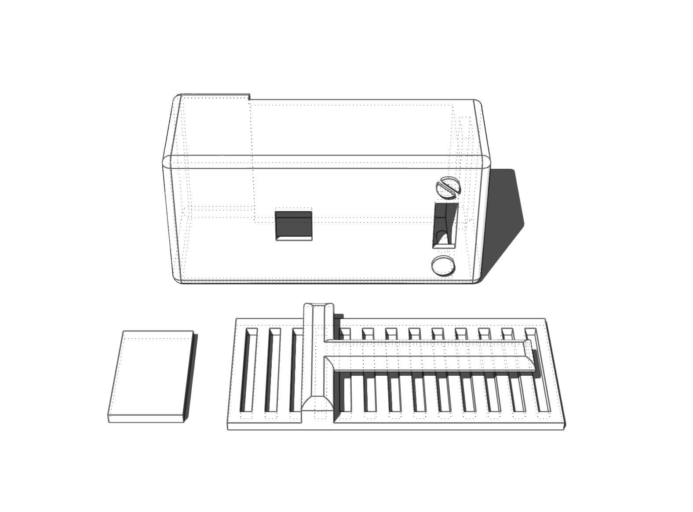
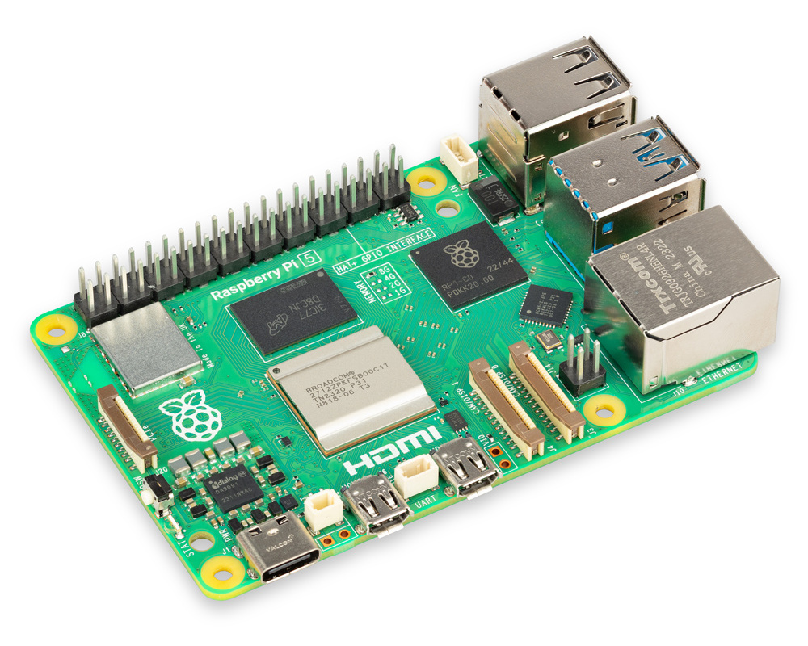

# *ScreenTimer*
## **CASA0016 Course Work** 
### _A Device for Screen Usage Detection and Data Visualization_


In this project, I designed a **physical device** to **detect and record** the usage time of various screens in daily life, such as the mobile phone and laptop. The primary goal is to **visually display** this data on an **interesting flip clock**.

<div align=center>
  
</div>

## Folder Structure

```none
Screen Timer Project
├── Code (All the code for Arduino UNO, ESP32 and Rasberry Pi)
│   ├── Arduino (Code tested on Arduino UNO R4 Wifi)
│   │   ├── Final_Mqtt_MultiMotor (Integrated Code)
│   │   │   ├── Final_Mqtt_MultiMotor.ino (Main Part)
│   │   │   ├── wifiConfig.h (Create your own config file!!)
│   │   ├── Hall_Effect_Sensor_Test
│   │   │   ├── Hall_Effect_Sensor_Test.ino
│   │   ├── IO_Extender_Motor
│   │   │   ├── IO_Extender_Motor.ino
│   │   ├── LDR_Test
│   │   │   ├── LDR_Test.ino
│   │   ├── WiFiS3_test
│   │   │   ├── WiFiS3_test.ino
│   ├── ESP32 (Code tested on ESP32 With CAM Module)
│   │   ├── app_httpd.cpp
│   │   ├── camera_index.h
│   │   ├── camera_pins.h
│   │   ├── CameraWebServer.ino
│   │   ├── wifiConfig.h
│   ├── Rasp_Pi (Code tested on Rasp Pi 4B)
│   │   ├── mqttConfig.py (Create your own config file!!)
│   │   ├── test.py (Main Part)
│   │   ├── yolov8n.pt (Pretrained Model ckpt file)
├── Enclosure
│   ├── video_collection_component_enclosure.3dm (File for 3d printing)
│   ├── Enclosure/laserCut.dxf (File for Laser Cutting)
├── Src (Image and gif for README)
│   ├── ...
├── .gitignore
├── README.md (Intro)

```

## Parts List
The device consists of three components: the Video collection component, the data processing component, and the time display component.
### 1. Video Collection Component
**1.1 FREENOVE ESP32-WROVER CAM Board**

_To minimize the size of our visual data collection device while ensuring essential functionality._

<table>
  <tr>
    <td>
      <p><b>Microprocessor Selection:</b></p>
      <ul>
        <li><i>ESP32 Series</i>: Renowned for its efficiency, the ESP32 series microprocessor has been chosen for its ability to strike an optimal balance between a small form factor and robust performance.</li>
      </ul>
      <p><b>Key Benefits:</b></p>
      <ul>
        <li><i>Seamless Image Capture</i>: Compact camera module ensures high-quality data acquisition.</li>
        <li><i>Effortless Connectivity</i>: Wireless network connection module facilitates easy and reliable data transmission.</li>
      </ul>
    </td>
    <td>
      <div align="center">
        
      </div>
    </td>
  </tr>
</table>


**1.2 Lithium Polymer Battery**

_In choosing components for our project, i want to ensure that my device remains portable while delivering robust performance._

<table>
  <tr>
    <td>
      <p><b>Power Supply Selection:</b></p>
      <ul>
        <li><i>Lithium Polymer batteries</i>: are known for their high energy density and flexible form factor. Unlike traditional rigid batteries, they can be made in various shapes and sizes, which allows for more versatile design options. Their chemistry offers a good balance between weight and energy output, making them popular in portable electronics.</li>
      </ul>
      <p><b>Key Benefits:</b></p>
      <ul>
        <li><i>High Compatibility</i>: With a 3.7V nominal voltage, the Lithium Polymer battery aligns well with the ESP32's 3.3V operation.</li>
        <li><i>Compact and Lightweight</i>: Dimensions of 34.5 x 56 x 10.6 mm and a weight of 40g make this battery an excellent choice for maintaining portability.</li>
        <li><i>Efficient Energy Storage</i>: A capacity of 2000 mAh provides a reliable and long-lasting power source, suitable for extended device operation.</li>
      </ul>
    </td>
    <td>
      <div align="center">
        
      </div>
    </td>
  </tr>
</table>

**1.3 Slide Switches With 3 Pin 2 Position**

_The module includes a 3-Pin 2-Position switch as the primary control for activating the screen detection device._

<table>
  <tr>
    <td>
      <p><b>Switch Type:</b></p>
      <ul>
        <li><i>Slide Switches With 3 Pin 2 Position</i> are known for its reliability and versatility, offering a clear on/off state without ambiguity. Its 3-pin configuration allows for straightforward integration into the circuit, simplifying the design and assembly process.</li>
      </ul>
      <p><b>Activation Process:</b></p>
      <ul>
        <li>When switched on, the device powers up and initiates the video data collection from the integrated camera.</li>
        <li>The captured video data is then transmitted to the data processing module for analysis.</li>
      </ul>
    </td>
    <td>
      <div align="center">
        
      </div>
    </td>
  </tr>
</table>

**1.4 3D Enclosure**

_I designed the enclosure for this component and print it out which can be attached to your clothes._

The enclosure I designed is installed in a pin-like manner, allowing for easy placement of the battery and ESP32 inside the box. There are two small holes on the front of the box; the middle opening is for the camera, and the lower opening is for toggling the switch. Symbols are placed on both sides to indicate the current status of the device. The back of the box features a clip-like design, making it convenient to attach the entire data collection box to clothing or a lanyard.

<table align=""center>
  <tr>
    <td>
        <div align="center">
            
        </div>
    </td>
    <td>
      <div align="center">
        
      </div>
    </td>
  </tr>
</table>

You can download the 3d model in this [link](https://github.com/Tianming-Liu/CASA0016_ScreenTimer/blob/main/Enclosure/video_collection_component_enclosure.3dm).

### 2. Data Processing Component

_The Raspberry Pi 4B is mainly selected for its robust computational capabilities, essential for running lightweight deep learning models._

<table>
  <tr>
    <td>
      <p><b>Key Advantages: </b></p>
      <ul>
        <li>Efficient Deep Learning Processing: Its powerful processor and sufficient RAM enable efficient execution of deep learning algorithms, crucial for real-time data processing;</li>
        <li>Reliable Data Transmission: Offers reliable and fast data transmission capabilities, ensuring seamless integration with other components of the system; </li>
        <li>Versatile and Scalable: The Raspberry Pi 4B’s versatility makes it suitable for various applications, and its scalability allows for future enhancements and upgrades.</li>
      </ul>
    </td>
    <td>
      <div align="center">
        
      </div>
    </td>
  </tr>
</table>

### 3. Data Visualization Component

In this module, I control the component through the Arduino UNO R4 Wifi microprocessor. The important parts include the LDR sensor, LCD display, and a flip clock made by referencing an open-source project(Bezanson, 2019). Among these, the flip clock serves as the main activator, and I aim to express the behavior of using digital products in a de-electrified manner. The component responds to both of the screen usage time and lighting environment of the user.

| Part | Image | Part | Image |
|------|-------|------|-------|
| Arduino UNO R4 Wifi |  | PCF8574 IO Expansion Board |  |
| Uln2003 Motor Driver Board |  | Stepper Motor 28BYJ-48 |  |
| Hall Effect Sensor |  | Neodymium Magnets|  |
| LDR Sensor |  | LCD Screen |  |
| Lego Bricks |  | [LaserCut Enclosure](https://github.com/Tianming-Liu/CASA0016_ScreenTimer/blob/main/Enclosure/laserCut.dxf) |  |


## Results

Finally, the project achieved the process of collecting video streams using wearable cameras, processing video data on a Raspberry Pi and outputting screen usage time data, followed by displaying various screen usage times through a flip clock. Additionally, in focusing on screen usage behavior, the project also considered the quality assessment of the screen usage environment.

<div align="center">
  
</div>

<div align="center">
  
</div>

The following gif shows the process of motor resetting after turnning on the device. The motor will rotate the clock panels to "0" respectively and then start to connect the MQTT so as to display the real time screen usage duration.

<div align=center>
  
</div>


## Future

- _Enhancing Processing Efficiency and Accuracy_
Adopt models suitable for low-power devices, like TinyML, to improve the speed and accuracy of data processing on small devices like the Raspberry Pi.

- _System Optimization and Integration_
Simplify system configuration by using more powerful computing devices, and enhance device integration and ease of deployment through 3D Enclosure design.
- _Data Transmission and Expansion of Application Scenarios_
Optimize data transmission processes to expand application scenarios, making the device an efficient urban sensing tool for researchers and general users.
## Acknowledgements

This project makes use of open-source components. We acknowledge and are grateful to these developers for their contributions.

- **Splitflap Display by Scott Bezek**: This project utilizes components from the Splitflap display designed by Scott Bezek. The original project can be found at [Splitflap](https://github.com/scottbez1/splitflap#design-overview). 
- **Ultralytics YOLO**: Our project incorporates models from Ultralytics YOLO, an efficient and versatile object detection system. More information can be found at their GitHub repository [Ultralytics](https://github.com/ultralytics/ultralytics).

