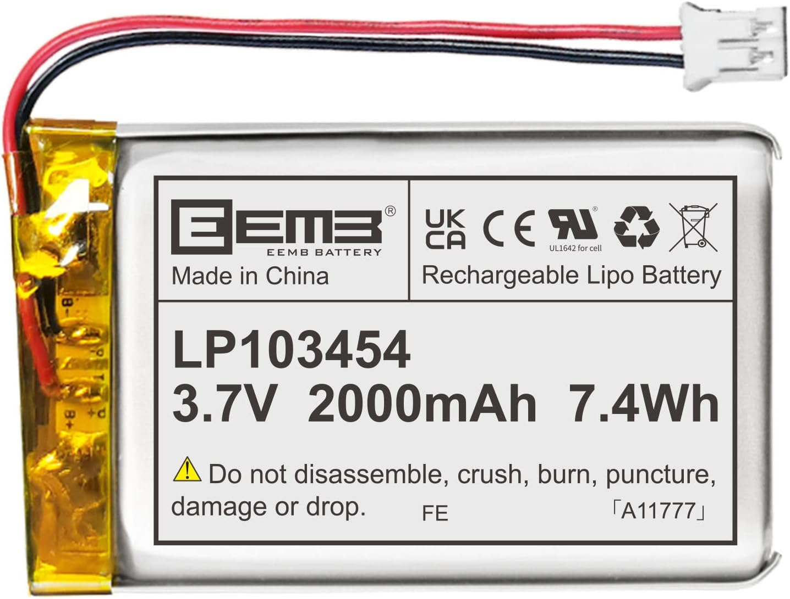

# *ScreenTimer*
## **CASA0016 Course Work** 
### _A Device for Screen Usage Detection and Data Visualization_


In this project, I designed a **physical device** to **detect and record** the usage time of various screens in daily life, such as the mobile phone and laptop. The primary goal is to **visually display** this data on an **interesting flip clock**.

<div align=center>
  
</div>

## Folder Structure

```none
Screen Timer Project
├── *Code* (All the code for Arduino UNO, ESP32 and Rasberry Pi)
│   ├── Arduino (Code tested on Arduino UNO R4 Wifi)
│   │   ├── Final_Mqtt_MultiMotor (Integrated Code)
│   │   │   ├── Final_Mqtt_MultiMotor.ino (Main Part)
│   │   │   ├── wifiConfig.h (Create your own config file!!)
│   │   ├── Hall_Effect_Sensor_Test (Integrated Code)
│   │   │   ├── Final_Mqtt_MultiMotor.ino (Main Part)
│   ├── Test (I save the sperate module script to test different function)
│   │   │   ├── ConnectToWifi
│   │   │   │   ├── ConnectToWifi.ino
```

## Parts List
The device consists of three components: the Video collection component, the data processing component, and the time display component.
### 1. Video Collection Component
**1.1 FREENOVE ESP32-WROVER CAM Board**

_To minimize the size of our visual data collection device while ensuring essential functionality._

<table>
  <tr>
    <td>
      <p><b>Microprocessor Selection:</b></p>
      <ul>
        <li><i>ESP32 Series</i>: Renowned for its efficiency, the ESP32 series microprocessor has been chosen for its ability to strike an optimal balance between a small form factor and robust performance.</li>
      </ul>
      <p><b>Key Benefits:</b></p>
      <ul>
        <li><i>Seamless Image Capture</i>: Compact camera module ensures high-quality data acquisition.</li>
        <li><i>Effortless Connectivity</i>: Wireless network connection module facilitates easy and reliable data transmission.</li>
      </ul>
    </td>
    <td>
      <div align="center">
        
      </div>
    </td>
  </tr>
</table>


**1.2 Lithium Polymer Battery**

_In choosing components for our project, i want to ensure that my device remains portable while delivering robust performance._

<table>
  <tr>
    <td>
      <p><b>Power Supply Selection:</b></p>
      <ul>
        <li><i>Lithium Polymer batteries</i>: are known for their high energy density and flexible form factor. Unlike traditional rigid batteries, they can be made in various shapes and sizes, which allows for more versatile design options. Their chemistry offers a good balance between weight and energy output, making them popular in portable electronics.</li>
      </ul>
      <p><b>Key Benefits:</b></p>
      <ul>
        <li><i>High Compatibility</i>: With a 3.7V nominal voltage, the Lithium Polymer battery aligns well with the ESP32's 3.3V operation.</li>
        <li><i>Compact and Lightweight</i>: Dimensions of 34.5 x 56 x 10.6 mm and a weight of 40g make this battery an excellent choice for maintaining portability.</li>
        <li><i>Efficient Energy Storage</i>: A capacity of 2000 mAh provides a reliable and long-lasting power source, suitable for extended device operation.</li>
      </ul>
    </td>
    <td>
      <div align="center">
        
      </div>
    </td>
  </tr>
</table>

**1.3 Slide Switches With 3 Pin 2 Position**

_The module includes a 3-Pin 2-Position switch as the primary control for activating the screen detection device._

<table>
  <tr>
    <td>
      <p><b>Switch Type:</b></p>
      <ul>
        <li><i>Slide Switches With 3 Pin 2 Position</i> are known for its reliability and versatility, offering a clear on/off state without ambiguity. Its 3-pin configuration allows for straightforward integration into the circuit, simplifying the design and assembly process.</li>
      </ul>
      <p><b>Activation Process:</b></p>
      <ul>
        <li>When switched on, the device powers up and initiates the video data collection from the integrated camera.</li>
        <li>The captured video data is then transmitted to the data processing module for analysis.</li>
      </ul>
    </td>
    <td>
      <div align="center">
        
      </div>
    </td>
  </tr>
</table>

### 1. Video Collection Component

## Common Issues

**1. No moisture value**

<center>
  
</center>


  This mostly result from a extremly large resistance between two nails. 
    
For example, when you test the code at first, you may hold the two respectively with your hands, the voltage read by the analog pin is too small to return.

**2. Rasberry Pi SSH Connection**

The format for ssh connection is 

<u>"ssh {rasp pi username}@{rasp pi hostname}.local"</u>

The password is set up behind the username.

## Current Output

- Data In CE-Lab MQTT Broker From My Own Topic
<center>
  
</center>

- Data In InfluxDB Dashboard
<center>
  
</center>

- Data Visualization in Grafana Dashboard

<center>
  
</center>


## Future

### 1. Build Website Interaction

Set up web connection to mqtt and interactive with a led light to remind people around the plant through sending message to a newly built topic.

Collect and visualize the data on the same website. Analyse the former status of plant, compute the last time someone watering plant. 

<center>
  
</center>

### 2. Change the Watering Method with automatic control

Switching from top watering to bottom watering and adding an automatic control module that allows people to operate it from the website above. 

Bottom watering can prevent the topsoil from becoming too compact, allowing water to flow smoothly and avoiding waterlogging, which can attract many mosquitoes.

<center>
  
</center>

### 3. Parametric model for 3d Enclosure

Estabilish a parameteric model that fits various pot sizes. With combination of 3D printing tech, we can finish the 3D enclosure models quickly.

The general workflow for the parametric model:

- Input: Port Shape, Port Size, Depth of the Gap

- Output: STL Format Model (For 3D Modelling)

A simple demo in Rhino.

<center>
  
</center>

## Lisence
